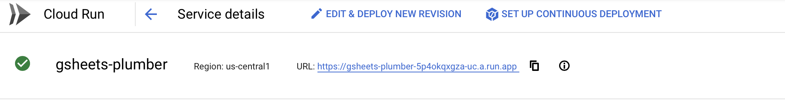
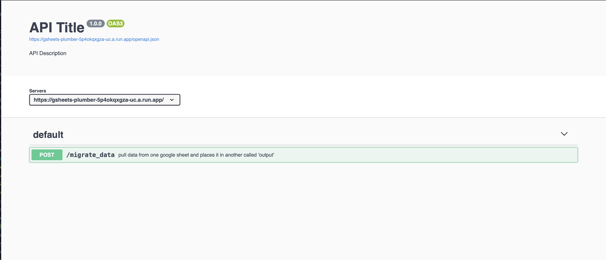
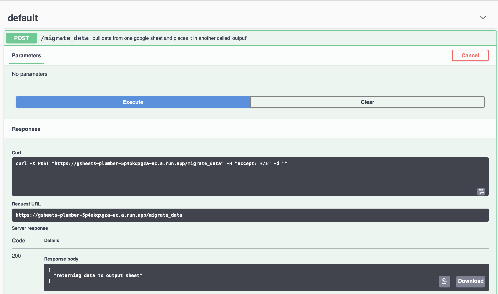
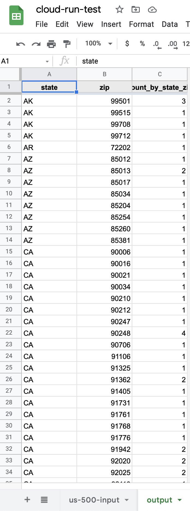

# Building an API using Plumber and Cloud Run

Now that we are more familiar with how Docker works and comfortable with building and running containers, we can put our knowledge into further practice. Our use-case for this tutorial will be to set up an API on Cloud Run that will allow us to automatiaclly pull and manipulate data in a google sheet, and dump the output into a new tab of that same sheet. To do that, we will need to set up a server and app with R's PLumber package, connect to our google sheet using the R `gsheets4` API, and then set up an endpoint we can access via a POST call with our API.

Once we have this up and running, we can schedule this POST Call to be scheduled to run daily via Cloud Scheduler!

## Connecting To Google Sheets via R

Before we do anything with Docker, let's make sure we can accomplish the task of connecting to a Google Sheet via an R Package, do something with the data we read, and then export our output into a new tab of the same sheet. To do this we will need to install a few packages. This is going to be stored in a fille called `install_packages.R` so do that but you can also install directly from the console in Rstudio.

        install.packages("gsheets4")
        install.packages("dplyr"))

Now let's write our code to connect R to our google sheet. I have set up a Google sheet with one tab called "us-500-input" which contains 500 fake addresses and phone numbers for people in the US. We are going to do a simple pivot operation to demonstrate how we can easily use libraries like dplyr to work with data and run it in an app on the cloud. Here' what our function will look like before we apply it as an endpoint in our application:

```{r}
library(googlesheets4)
library(dplyr)
# print a message
print("hello world")

# authenticate with google sheets
gs4_auth(path = "key.json", scopes = "https://www.googleapis.com/auth/spreadsheets")

# read data from a google sheet
#mytable <- as.data.table(read_sheet(ss = "https://docs.google.com/spreadsheets/d/1K6F1jd5SU5NZI0Mv4zoB7n12O32GmZ_lyNwZSMnu0nU/edit?usp=sharing", sheet = "us-500-input"))
mytable <- read_sheet(ss = "https://docs.google.com/spreadsheets/d/1K6F1jd5SU5NZI0Mv4zoB7n12O32GmZ_lyNwZSMnu0nU/edit?usp=sharing", sheet = "us-500-input")

# write data to a google sheet

table2 = mytable %>%
  group_by(state, zip) %>%
  summarize(count_by_state_zip =  n())


newdata <- data.table(x = Sys.time(), y = 1:10)
googlesheets4::sheet_write(ss = "https://docs.google.com/spreadsheets/d/1K6F1jd5SU5NZI0Mv4zoB7n12O32GmZ_lyNwZSMnu0nU/edit?usp=sharing", data = table2, sheet="output")
```

To run this locally from Rstudio, you may get a prompt in your console to authenticate via a link provided. When we go to run this code in our app, we will need our key.json file. Refer to the r_docker tutorial on how to create this credential file.

## Setting up an API with Plumber

Now that we have our code to connect to Google Sheets working properly, we need to figure out how to set it up to be run on command whenever we make a REST API call. This way we scheduled that call, or just use it whenever we want without actually having to manually run any code. We can do this and stick with writing R using the handy [Plumber](https://www.rplumber.io) package. 

As with most API and web applications, we will need a server layer to handle the requests, and an application layer to run our code to do the "stuff" that we want our app to do. Let's take our R code we wrote before and pass it into our application as a function.

### app.R
```(r)
# app.R

library(dplyr)
library(googlesheets4)

#' pull data from one google sheet and places it in another called 'output'
#' @post /migrate_data
function(){
# authenticate with google sheets
    gs4_auth(path = "key.json", scopes = "https://www.googleapis.com/auth/spreadsheets")

    # read data from a google sheet
    #mytable <- as.data.table(read_sheet(ss = "https://docs.google.com/spreadsheets/d/1K6F1jd5SU5NZI0Mv4zoB7n12O32GmZ_lyNwZSMnu0nU/edit?usp=sharing", sheet = "us-500-input"))
    mytable <- read_sheet(ss = "https://docs.google.com/spreadsheets/d/1K6F1jd5SU5NZI0Mv4zoB7n12O32GmZ_lyNwZSMnu0nU/edit?usp=sharing", sheet = "us-500-input")

    # write data to a google sheet

    table2 = mytable %>%
    group_by(state, zip) %>%
    summarize(count_by_state_zip =  n())


    #newdata <- data.table(x = Sys.time(), y = 1:10)
    googlesheets4::sheet_write(ss = "https://docs.google.com/spreadsheets/d/1K6F1jd5SU5NZI0Mv4zoB7n12O32GmZ_lyNwZSMnu0nU/edit?usp=sharing", data = table2, sheet="output")
    print('returning data to output sheet')
}

print('app.R running')
```
Here we can see we copied our google sheets logic into a function(), and are using `roxygen` syntax to associate that function with a POST call named /migrate_data. When our app is up and running, we can use this endpoint to run our code and read the data from our google sheet and spit out the output.

This code is useless on it's own, we need to dish out this endpoint via our API on the server layer. Let's create that like so:

### server.R

```(r)
# server.R

library(plumber)
# 'app.R' is the location of the file containing your endpoint functions
r <- plumb("app.R")
# get port number from environment variable
port <- strtoi(Sys.getenv("PORT"))
r$run(port=port, host='0.0.0.0', swagger=TRUE)
```
We can see there's not much to this, which is nice because the Plumber library does most of the heavy lifting by passing our "app.R" code via the `plumb()` function. There's also some settings telling our server what PORt to run from (we'll get to this in a bit) as well as turning on the built in documentation service powered by Swagger. This will make things very easy for us to test our app and make sure everything is working.

## Building the container image

OK, we have our app, and we have our server, now we just need to bundle everything into a container so that we can deploy it on the cloud. To do this we will be using Docker again, and we'll be using another pre-made image so we don't have to build it from scratch. At this point you'll probably notice we haven't installed Plumber yet, that's because Rocker has a prebuilt image we can start from, then all we'll need to install are the additionakl packages we use in `app,R`. Let's pull that docker image into our working environment via Cloud Shell Editor like we did in the previous tutorial:

        docker pull rstudio/plumber

Once we have our base image installed via Docker, we can start crafting our Dockerfile:

### Dockerfile

```(docker)
FROM rstudio/plumber

# Create and change to the app directory.
WORKDIR /usr/src/app

# Copy local code to the container image.
COPY . .

RUN Rscript install_packages.R

EXPOSE 8080

# Run the web service on container startup.
CMD [ "Rscript", "server.R"]
```

Let's quickly go over what this blueprint is doing. We are pulling our base image `rsudio/plumber` this saves the time and hassle of having to install plumber when we build the image. Then we navigate to working directory of our app so we can copy our code from our local files to the app directory of our image. Then we use the RUN commmand to run our `install_packages.R` script we made previously to pull in our other R dependencies. ```EXPOSE 8080``` exposes the port we want our docerk container to connect to the OS the container is running on, and then finally our installation process is done, and we tell our container to launch our app via the `CMD` command.

### Build the image.

Since we are deploying this on Cloud Run, we will need a cloudbuild.yaml so that Google Cloud know what tools to use to build our image and what code to include:

### cloudbuild.yaml

```
steps:
  # build the container image
  - name: 'gcr.io/cloud-builders/docker'
    args: ['build', '-t', 'gcr.io/fleet-cyclist-299216/gsheets_plumber', '.']
    # push the container image to Container Registry
  - name: 'gcr.io/cloud-builders/docker'
    args: ['push', 'gcr.io/fleet-cyclist-299216/gsheets_plumber']

```

We can then build our image and store it in the container regsitry like so:

         gcloud builds submit --config cloudbuild.yaml .

Keep in minde the `.` is used assuming you have navigated to the directory where both your `cloudbuild.yaml` file and `Dockerfile` are stored, if you are outside that directory you will have to use the corresponding path so the gcloud SDK knows where to look.

Wait for the image to build, you should get an indication in the terminal indicating "SUCCESS" and a link to where your build is stored.

## Deploy our app image to cloud Run
Now for the big moment! We have our image ready to go, now we just need to deploy and test! Just like before we are going to go to the Cloud Run UI and deploy our app by navigating to our successfull "gsheets_plumber" build. Use the basic setting as mentioned before, and deploy to port `8080` for now just so we know the app will work. When it's deployed you should see a green check mark next to your service name in Cloud Run as well as a URL to run from:



Congrats! Our app is up and running! Let's copy that URL, and open from the swagger endpoint by appending `/__docs__/` at the end of the url. This will bring us to the Swagger page, where we can see all of our endpoints and even test them out!



Let's try out our `/migrate_data` end point that we created. Let's first take a look at our google sheet. We should have one tab called 'us-500-input' with all of our input data. Let's try out our endpont but having Swagger run the POST `/migrate_data `command for us.



If we then look at our google shee, we can see our endpoint fired and created our pivot table in a new tab calledj `output` in our Google Sheet!



Well that was fun, and our app is working as intended. There a few more things we can do to clean it up, but the last thing we are going to worr about for now is securing our app in GCP and figuring out how to manage API credentials securely so we utilize third party data for some more automated dat analysis!

This can be found in the tutorial [Securing a Service in Cloud Run](/securing-containers/cloud-run-security.md)


