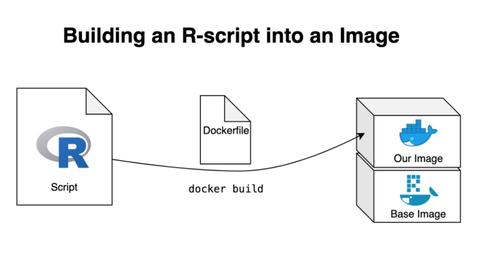
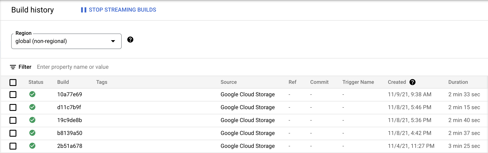
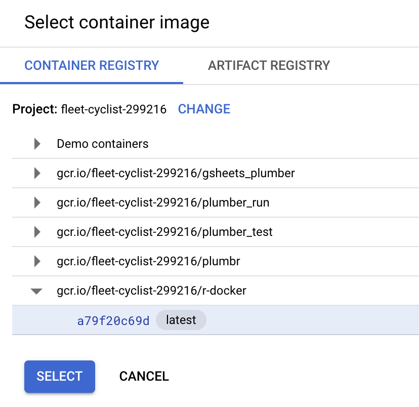
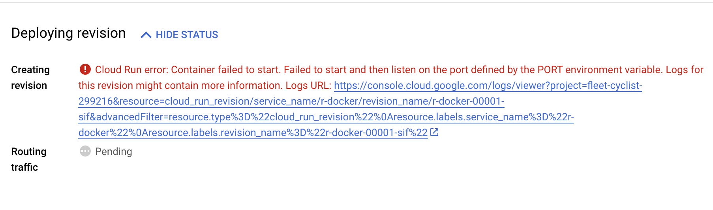
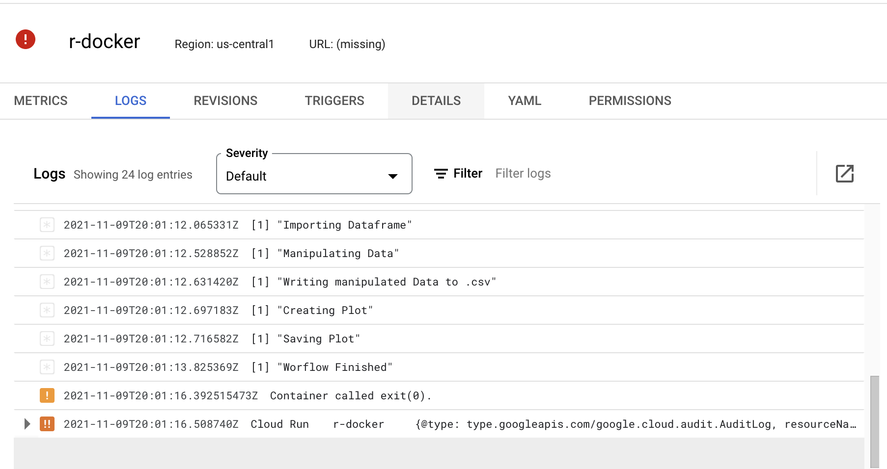

# Deploying R in Docker
In this tutorial we will answer the question: How do we efficiently and securely deploy an R script in Docker, and deploy it to Google Cloud Run. In order to answer this question adequately, we need to break it down into a process that is composed of two parts.
1. Set up an R environment in Docker
2. Deploy that image to Google Cloud Platform via Cloud Run
## What is Docker?
Docker is a tool that allow developers to deploy their applications in a sandbox and run on a host OS. The key benefit is that allows users to package an application and all of its dependencies within a standardized unit for software development. They differ from virtual machines in that that they do not have high overhead in terms of resources used and therefore use the underlying system runnign it more efficiently.

## What is an image?
An image is a read-only template with instructions for creating a Docker container. Often, an image is based on another image, with some additional customization. For example, you may build an image which is based on the ubuntu image, but installs the Apache web server and your application, as well as the configuration details needed to make your application run.

## What is a container?
Docker as a technology is built around the concept of a container. A container is similar to a virtual machine in that it is able to operate independently, but different because it can use the lower level resources required to run programming on the host OS.

source: https://docker-curriculum.com

## Setting up an R environment in Docker
### Install Docker
Make sure you have docker installed on your computer and you have access to a Code Editor and command line shell., this can be tested locally by installing Docker (we will be on MacOSX for this tutorial) or making sure docker is connected in Google Cloud Shell via [this tutorial]

First, let's set up our container and base image.

### Pull the R Base image
First we are going to pull an image from the Open Source [Rocker](https://hub.docker.com/u/rocker) project. "Pulling" an image refers to downloading a previously created image with software included prebuilt, so we don't have to do the heavy lifting of setting up an R environment from scratch. We have two options. There is an `r-base` image that has a bare bones R environment, we can also use the `r-tidyverse` base image if we want some more data science tools right off the bat...

      docker pull rocker/r-base
We can test out and run the docker container with this:

      docker run -it --rm rocker/r-base

From this initial test run we can see the terminal was turned into an R console, which we can now interact with thanks to the -it argument. The —-rm argument makes sure the container is automatically removed once we stop it. 

One thing to keep in mind is that when a container starts, it is creating the environment from the compressed image stored within that conainers source content. Typically if we wanted to run an R script we would need to install packages. What we'll want to do is make sure those packages are installed from the get go. We can do this by setting up our Docker file to serve as a blueprint. The Docker file sets up the container image. We can build the container from the Docker file and it will have all of the code and packages and software needed to run our R environment in isolation and execute our script. Our software is self contained!

### Setting up the Docker file

With a Dockerfile, we tell Docker how to build our new image. A Dockerfile is a text file that must be called `Dockerfile` and by default is assumed to be located in the build-context root directory (which in our case would be the r_docker folder within our repository). First, we have to define the image on top of which we’d like to build ours. Depending on how we’d like our image to be set up, we give it a list of instructions so that running containers will be as smooth and efficient as possible. In this case, we want to base our new image on the previously discussed rocker/r-base image. Next, we replicate the local folder structure, so we can specify the directories we want in the Dockerfile. After that we copy the files which we want our image to have access to into said directories – this is how you get your R script into the Docker image. Furthermore, this allows us to prevent having to manually install packages after starting a container, as we can prepare a second R script that takes care of the package installation. Simply copying the R script is not enough, we also need to tell Docker to automatically run it when building the image. And that’s our first Dockerfile!

     # Base image https://hub.docker.com/u/oliverstatworx/
      FROM oliverstatworx/base-r-tidyverse:latest

      ## create directories
      RUN mkdir -p /01_data
      RUN mkdir -p /02_code
      RUN mkdir -p /03_output

      ## copy files
      COPY /02_code/myScript.R /02_code/myScript.R
      COPY /01_data/us-500.csv us-500.csv
      

      ## run the script
      CMD Rscript /02_code/install_packages.R
      CMD Rscript /02_code/myScript.R

We will setup our two scripts in the /02_code directory. One for our script execution and one for installing packages. We can see in our docker file we first load our base R image, create directories to host our code, input, and output files. Then we will copy said files from wherever they are locally stored into the docker image. Then finally we install our R packages and run the script!

We now have our R image set up and ready to run our script via Docker. Let's build our image. Building the image will take our Dockerfile and assemble our image in accordance to the blueprint laid out:

      docker build -t myname/myimage .

Building the image will take a few minutes to get everything set up and install any miscellaneous r packages included in our `install_packages.R`

Once the build is finished, we can run our container again!

      docker run -it --rm -v ~/Documents/Contracting/Ben/r_docker/01_data:/01_data -v ~/Documents/Contracting/Ben/r_docker/03_output:/03_output myname/myimage

This time, we need to mount our local directories to the ones we created in Docker as *volumes*. Volumes are the preferred mechanism for persisting data generated by and used by Docker containers. When we use the -v argument we can match our local directory (the path before the :) to the directory created within the container.

When running the container, we can see the R environment boot up and execute our script, we can also see our result files, a graph, `myplot.png`, and our `plot_data.csv` in the /03_output directory. Using volumes we can quickly set up our enclosed R container to spit out usable output.

So, now that we know how docker works and have our image working on our desktop, now we just need to figure out how to deploy it to Google Cloud Platform, and then schedule it. Let's get to it!

## Building our image on the cloud using Cloud Build

If we want this script to run on a regularly scheduled basis, Cloud Run is a service within Google Cloud Platform that fits this use case perfectly. Cloud Run is a managed compute platform that enables you to run containers that are invocable via requests or events. Cloud Run is serverless: it abstracts away all infrastructure management. Refer to the [documentation](https://cloud.google.com/run/docs) to learn more about Cloud Run.

To get started, we'll need to get our code into Google Cloud. This can be done through a git repo, but for demonstration purposes we are going to upload our code to Google Cloud Shell Editor and update and build our docker image from there. Then we can easily deploy from the Cloud Run UI. Make sure you have created a GCP project, and enabled the Cloud Run and Cloud Build services.

1. Let's upload our intro docker code we just made to Cloud Run to Cloud Shell Editor. We can access Cloud Shell Editor from the cloud console from the browser of our choice, then selecting Open Editor.

   
2. From the Explorer tab on the left, select New Folder and enter "r-docker" or drag and drop the folder from your desktop to the explorer tab and it will upload your folder with it's file structure. 
3. From the menu -> Terminal, open a new terminal pane. From here we are going to run commands to connect to Docker and build our container on the cloud.
4. From the terminal, connect to the correct project in GCP that you want to use:
##   
      gcloud config set project [PROJECT-NAME]

5. Next we need to make sure our environment is connected to Docker, which is already installed in GCP. To do this we will need to make sure our container has access to other services in GCP using a key file. We can create this key file with the following command. 
###

      gcloud iam service-accounts keys create key.json --iam-account=[PROJECT-NAME]@appspot.gserviceaccount.com

##
6. Now we are going to activate our service account we want the Docker container to build from

      gcloud auth activate-service-account --key-file=key.json

      gcloud auth configure-docker

7. Next we need to build our container image, and save it in the container registry on Docker so we can refer to our image template when we go to deploy. The cloudbuild.yaml will look like this:
##
      steps:
      - name: 'gcr.io/cloud-builders/docker'
        args: ['build', '-t', 'gcr.io/fleet-cyclist-299216/r-docker', '.']
      images: ['gcr.io/fleet-cyclist-299216/r-docker']

We will then submit this build file to Cloud Builds, a service that builds containers (Docker is one of the options) to be deployed as an app.
##
      gcloud builds submit --config cloudbuilds.yaml [repo directory]

You can see in the terminal that our docker image is getting built and saved to the container Registry, and the being saved as a build in Cloud Builds. Any time we need to make a change to our container, we will need to rebuild the image.

## Deploy the Build to Cloud Run
 Now that we have our build saved on the cloud. We can deploy to Cloud Run. There are ways to do this via the command line and our `cloudbuild.yaml`. But for simplicity we are going to use the UI so we can see our app being deployed in real time.

 1. Navigate to the Cloud Run page in your GCP Project and select create service 
 2. Select the `latest` stored image (you may have some failed builds) from your `r-docker` stored container. Name your service and leave all the other paramters as default, and allow for "unauthenticated" invocations. We are just testing out Cloud Run for now and will tear down the service when we are done. 
 3. When we are content with our setting, hit deploy, and wait for the image to deploy as a app.
 4. Unfortunately when we deploy, we are going to get an error that probably looks like this: 

But if we go to the logs tab below this error, we'll see that our script still ran, how could this be? The answer is, because we supplied the script which runs successfully, but we didn't supply an API infrastructure that most web applications needs to continiously operate. The script simply runs, and then our app times out. This is no good, we want our app to stay online so we can repeatedly do tasks. This is where we'll need something like the Plumber library in R, which will let us stand up an API and connect to endpoints to allow us to run our R code on command! 

You can find this in the tutorial found in the `gsheets-plumber` directory of this repository.